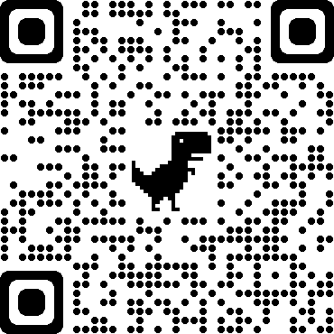

## CANVASTOIMAGE

### Intro
fork from [https://github.com/hongru/canvas2image](https://github.com/hongru/canvas2image)

1. download image support browser dpr, resolve the problem of blurry downloaded pictures
2. use npm


```bash
$ npm install canvastoimg --save
```

### Demo

[click here](https://joewrights.github.io/canvastoimage)

mobile scan this QR code


